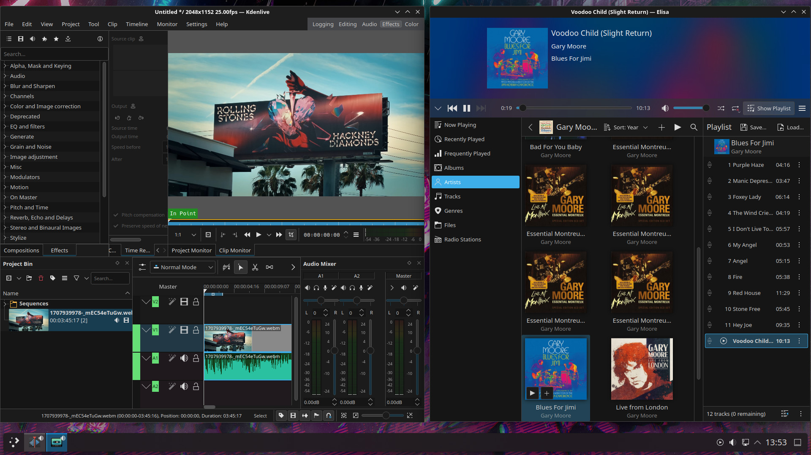
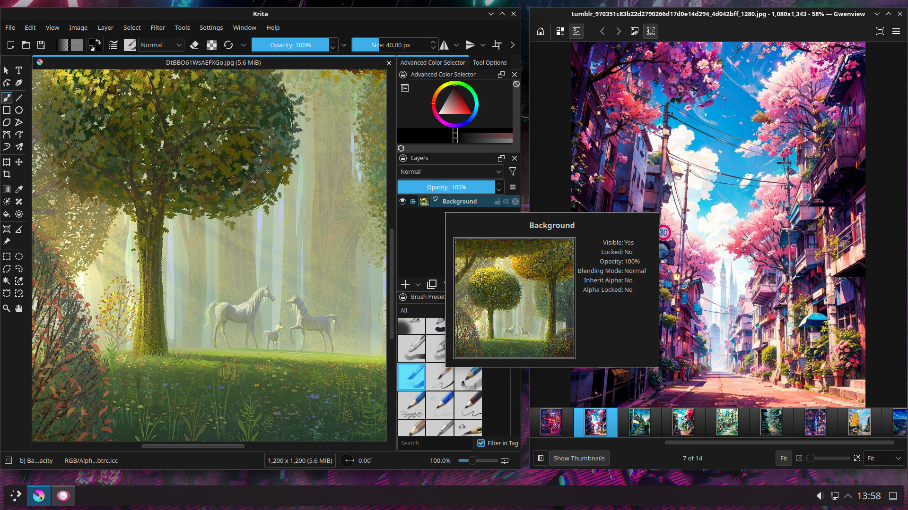
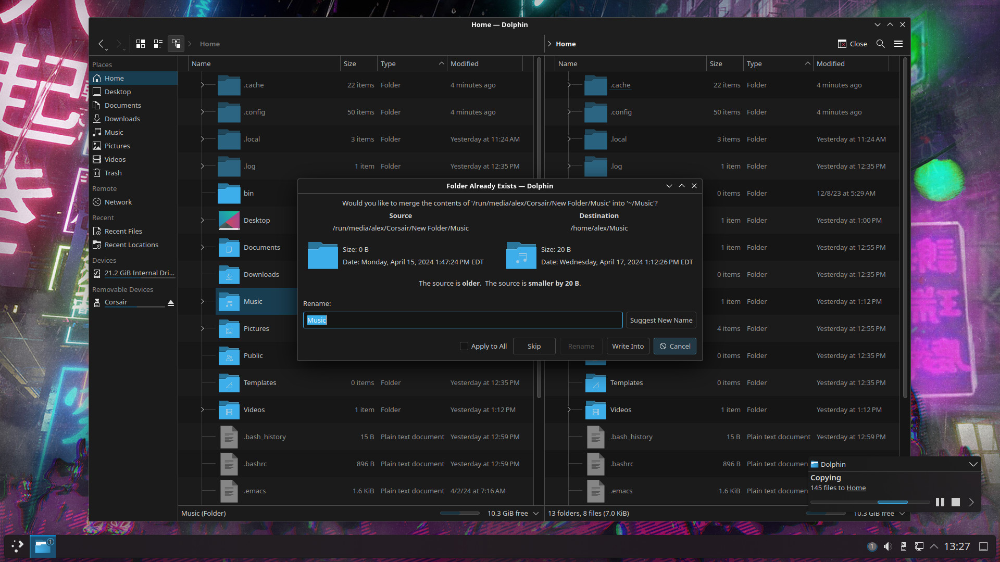
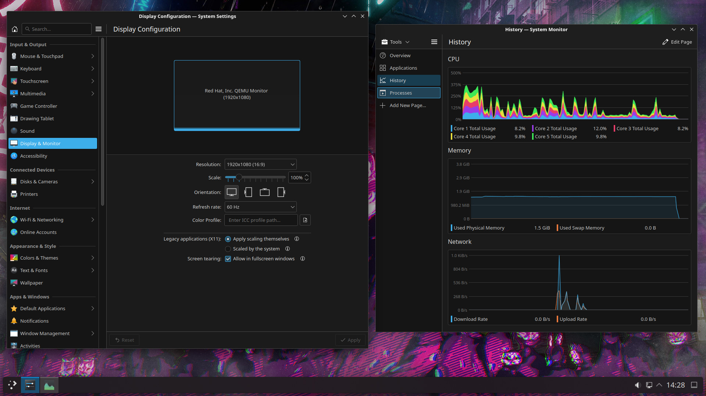
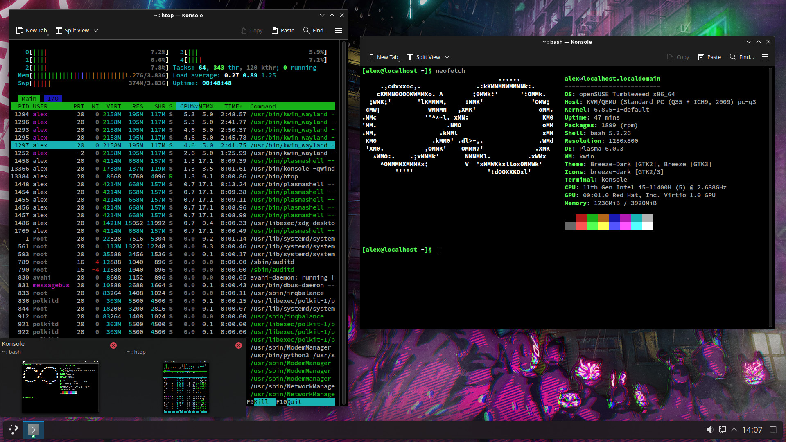
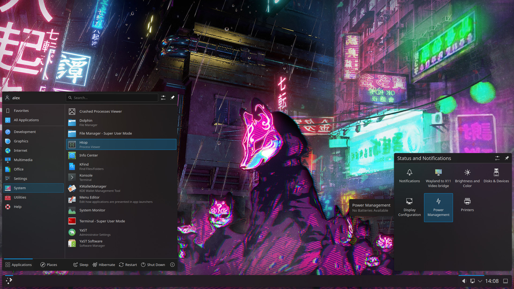

# Blueberry (Color Scheme)

Blueberry: a dark color scheme for the KDE Plasma 5/6 desktop environment.

## Screenshots

More screenshots

## Download and installation instructions

You can download this color scheme here:

* KDE Store: [https://store.kde.org/p/2148021](https://store.kde.org/p/2148021)
* Pling: [https://www.pling.com/p/2148021](https://www.pling.com/p/2148021)

Or you can manually copy the [blueberry.colors](https://raw.githubusercontent.com/serhiyguryev/blueberry-color-scheme/main/color-schemes/blueberry.colors) file to your home directory `.local/share/color-schemes/` (right-click on the link and choose `Save Link As...` from the menu that opens).

### Breeze folders

If you don't want Breeze folders to respect your color scheme's "Selection" color, edit `/usr/share/icons/breeze-dark/index.theme` (dark global theme) or `/usr/share/icons/breeze/index.theme` (light global theme) and set "FollowColorScheme" to `false`.

> [!IMPORTANT]
> This tip works only in Plasma 5 (in Plasma 6, such changes lead to unexpected results when dark theme icons start to appear as light theme icons).

## You may also like

* openSUSE [Splash Screen](https://github.com/serhiyguryev/opensuse-splashscreen) for Plasma 6
* A [Plymouth theme](https://github.com/serhiyguryev/plymouth-theme-opensuse) that displays the openSUSE logotype

## Support my work

You can support the further development of this project by choosing a convenient way to donate:

* **Bitcoin (BTC)**: bc1q6qtnwc2pdktvl48mr9hf0qmhaxfm7xseftp78a
* **Ether (ETH)**: 0x185e4FB1f662223B011dedbBd42A444891b094f5

## License

Licensed under the [GNU General Public License v3.0](https://github.com/serhiyguryev/blueberry-color-scheme/blob/main/LICENSE)
